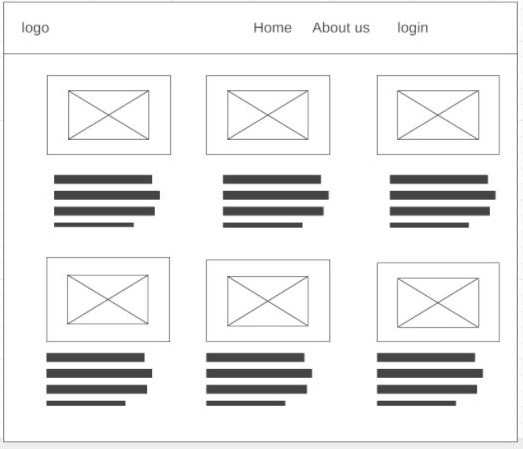
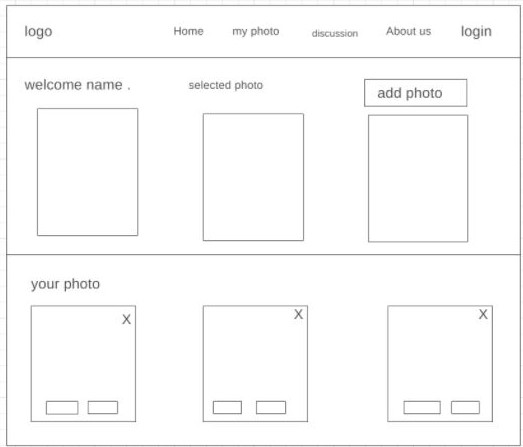
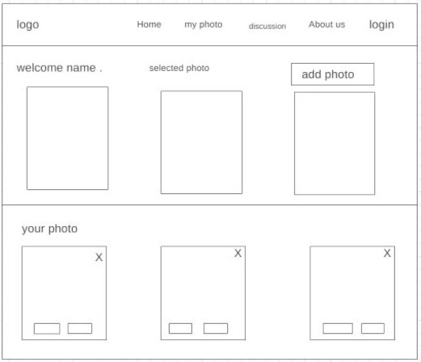
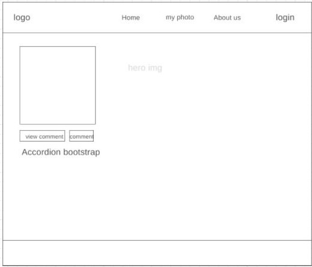

# Capture-It

# Team leader
Omar D'yab :  An engineer, I have a Bachelor’s in Communications Engineering,  I have a European Master's degree in Computer science, into chess and basketball.

# Team members : 
1. Nura Tabanjeh: hold a bachelor's degree in Civil Engineering from BAU, a web development student at ASAC, Nura enjoys ensuring that things running smoothly and create operations strategies to keep everything perfect.

2. Aya Abu Dager: 23 years old, have a bachelor’s degree in architectural engineering from Al al-Bayt University, decided to shift her career to be a full stack developer.

3. Nooraldeen Khalaf: 24 years old, have a bachelor's degree in civil engineering from  Hashemite University, and has a passion to be a professional in the tech field.

4. Khaleel Ghanem :27 years old, hold a bachelor's in Software Engineering from Zarqa university. 
I am passionate about learning new technologies and skills, and I hope to be a great developer.

5. Abdallah Elian:

# Name of Project: Capture-It
## Summary of the idea.
Capture-It is a website for photographers, offering a platform for sharing and interacting among photographers.
-storing your photos
-library for photos

# Wireframe 

# Group Project: Begin Wireframes & Software Requirements

## Five stories: 
1. As a user, I want to select one or more of your random high-resolution images.
2. As a user, I want to add my own photos to your website.
3. As a user, I want to see other users' photos with information (eg. title, description) and interact with them.
4. As a user, I want to decide whether to share my photos or not with other users. 
5. As a user, I want to update or delete my photos. 

## What is the vision of this product?

-The vision of our product is to have a community in which photographers share their talents of their own photos. 
What pain point does this project solve?
-Having an interactive platform for photographers.
## Why should we care about your product?
1. It's a very nice friendly platform that can be trendy. 

2. The app gives the user the opportunity to select one or more random high-resolution images.
3. The app gives the user the opportunity to add his/her own photos to the website.
4. The app gives the user the opportunity to see other users' photos with information (eg. title, description) and interact with it.
5. The app gives the user the opportunity to decide whether to share his/her photos with other users. 
6. The app gives the user the opportunity to update or delete his/her photos. 

Note: The app won't turn into an android app. 

# Minimum Viable Product (MVP):
Platform website to share photos among photographers.  
Stretch: upload photos from local.

# Functional Requirements
-Already mentioned. 

# Data Flow
The user should sign in to get access to our service using auth0, then by default, once created, a user data inside one collection in our database will be initiated.
the info of the user is shared with the database n order to add/delete/update records in our database.
once access to the user photos is granted it can be shared publicly in which the other collection can render photos for different users with interaction methods.

## Non-Functional Requirements (301 & 401 only):

1. Usability=> Having two collections for our database makes it easier to work on different components and retrieving data.
2. Testability=> It can be run with relatively little preparatory effort, It can be tested with relatively few lines of code and It can be executed quickly.